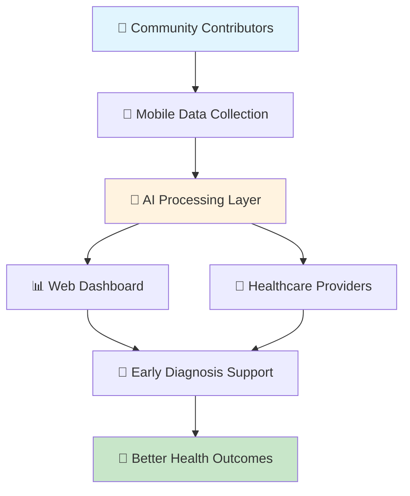
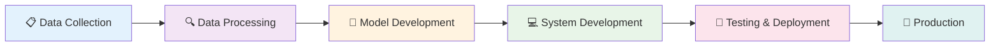

# 🏥 Kenya Health Language AI
### *Bridging the Language Gap in Digital Health*

<div align="center">


**🌍 Empowering healthcare through AI in Kenya's local languages**

[🚀 Live Demo](#demo) • [📖 Documentation](#documentation) • [🤝 Contributing](#contributing) • [💬 Community](#community)

</div>

---

## 🌟 What Makes This Special?

> **The first decentralized AI system designed specifically for health communication in Kenya's indigenous languages**

### 🩺 Context & Background
Kenya's local languages like **Kikuyu, Luo, Luhya, Kalenjin, and Kamba** are widely spoken, yet most health applications and AI-powered tools focus exclusively on high-resource languages (mainly English). This creates a critical language gap that limits equitable access to health information and effective communication with healthcare providers.

<table>
<tr>
<td width="50%">

### ⚠️ Critical Problems
- **Language Barrier**: Patients struggle with health information not available in local languages
- **Limited Data**: No comprehensive health dataset exists for Kenyan local languages
- **Inaccurate AI Tools**: Translation models misinterpret critical health terms, endangering patients
- **Lack of Early Diagnosis**: No AI-driven system for early disease detection in local languages

</td>
<td width="50%">

### ✅ Our Revolutionary Solution
- **Comprehensive multilingual health dataset** in Kenyan languages
- **AI-powered translation & diagnosis** optimized for medical contexts
- **Early disease detection support** for cancer, malaria, and chronic conditions
- **Decentralized system** ensuring privacy and accessibility

</td>
</tr>
</table>

### 👥 Who Benefits?
- **🏥 Patients** in rural and urban communities speaking local languages
- **👩‍⚕️ Healthcare providers** and community health workers
- **🔬 Researchers** and data scientists in language AI development
- **🏛️ Policy makers** designing inclusive health strategies

---

## 🔧 Core Features

<div align="center">

| 🎙️ Voice Processing | 🧠 AI Translation | 📱 Mobile Collection | 🏆 Gamification |
|:---:|:---:|:---:|:---:|
| Real-time audio transcription in local languages | Advanced NLP models fine-tuned for health contexts | Field-ready mobile app for data collection | NFT rewards and token incentives |

</div>

### 🏗️ System Capabilities



---

## 🛠️ Technology Stack

<div align="center">

### Frontend & Mobile


### Backend & Blockchain


### AI & ML


### Infrastructure


</div>

---

## 🚀 Quick Start

### Prerequisites
- **Node.js 18+** - [Download here](https://nodejs.org/)
- **DFX (Internet Computer SDK)** - Internet Computer development kit
- **Docker & Docker Compose** - For AI services containerization
- **Python 3.9+** - For AI/ML components

### 🔥 Complete Setup Guide

#### Step 1: Install DFX (Internet Computer SDK)
```bash
# Install DFX SDK
sh -ci "$(curl -fsSL https://smartcontracts.org/install.sh)"

# Verify installation
dfx --version
```

#### Step 2: Clone and Setup Project
```bash
# Clone the repository
git clone https://github.com/robinhoodai/kenya-health-language-ai.git
cd kenya-health-language-ai

# Install Node.js dependencies
npm install
```

#### Step 3: Initialize ICP Local Development
```bash
# Start the local Internet Computer replica
dfx start --background

# Deploy all canisters to local network
dfx deploy

# Generate Candid interfaces
npm run generate
```

#### Step 4: Launch AI Services
```bash
# Start AI API containers
cd ai-api
docker-compose up -d

# Verify AI services are running
curl http://localhost:8000/health
```

#### Step 5: Start Development Servers
```bash
# Terminal 1: Start frontend development server
cd frontend
npm start
# Frontend available at: http://localhost:8080

# Terminal 2: Start mobile app (optional)
cd mobile-app
npx react-native run-android  # or run-ios
```

### 🌐 Access Your Applications
- **Frontend Dashboard**: http://localhost:8080
- **AI API Documentation**: http://localhost:8000/docs
- **Canister Dashboard**: http://localhost:4943?canisterId={asset_canister_id}

<details>
<summary>🔧 Advanced DFX Commands</summary>

```bash
# Check canister status
dfx canister status --all

# View canister logs
dfx canister logs health_data

# Stop local replica
dfx stop

# Reset local state (fresh start)
dfx start --clean --background

# Deploy to IC mainnet
dfx deploy --network ic

# Check cycles balance
dfx wallet balance --network ic
```

</details>

<details>
<summary>🐛 Troubleshooting</summary>

**Common Issues:**

1. **Port conflicts**: Kill processes on ports 4943, 8000, 8080
```bash
lsof -ti:4943,8000,8080 | xargs kill -9
```

2. **DFX not found**: Add to PATH
```bash
echo 'export PATH="$HOME/bin:$PATH"' >> ~/.bashrc
source ~/.bashrc
```

3. **Docker issues**: Ensure Docker daemon is running
```bash
sudo systemctl start docker  # Linux
# or restart Docker Desktop
```

4. **Node modules**: Clear and reinstall
```bash
rm -rf node_modules package-lock.json
npm install
```

</details>

## 🏗️ Development Methodology

### 📊 Our Systematic Approach

<div align="center">



</div>

### 🎯 Phase-by-Phase Breakdown

<details>
<summary><strong>Phase 1: Data Collection 📋</strong></summary>

**Methodology:**
- **Multi-regional recruitment** across different counties and language groups
- **Structured interviews** using digital recorders with health professionals
- **Community engagement** through local health workers and language experts
- **Secure cloud storage** with encryption and access controls

**Quality Assurance:**
- Language expert validation
- Medical professional review
- Cultural context verification
- Privacy compliance checks

</details>

<details>
<summary><strong>Phase 2: Data Processing 🔍</strong></summary>

**Technical Pipeline:**
- **Audio preprocessing**: Noise removal, segmentation, normalization
- **Transcription workflow**: Expert linguists + Label Studio assisted annotation
- **Quality validation**: Super reviewers for accuracy verification
- **Data anonymization**: Remove PII, maintain medical context

**Privacy & Ethics:**
- GDPR compliance framework
- Informed consent protocols
- Data minimization principles
- Secure multi-party computation

</details>

<details>
<summary><strong>Phase 3: Model Development 🤖</strong></summary>

**AI/ML Stack:**
- **Base models**: OpenBioLLM, Meditron, BioMistral
- **Fine-tuning**: Domain-specific adaptation for Kenyan health contexts
- **Multimodal support**: Speech-to-text, text-to-speech integration
- **Evaluation metrics**: BLEU, ROUGE, medical terminology accuracy

**Model Architecture:**
```python
# Simplified model pipeline
Health_LLM = FineTune(
    base_model="OpenBioLLM",
    languages=["kikuyu", "luo", "luhya", "kalenjin", "kamba"],
    domain="kenyan_health",
    task=["translation", "diagnosis_support", "early_detection"]
)
```

</details>

<details>
<summary><strong>Phase 4: System Development 💻</strong></summary>

**Backend APIs:**
- Health prediction endpoints
- Translation services
- User management
- Data analytics

**Frontend Dashboards:**
- **Healthcare providers**: Diagnostic suggestions, translation support
- **Researchers**: Dataset analysis, model performance metrics
- **Administrators**: User management, system monitoring

**Mobile Integration:**
- React Native cross-platform app
- Offline functionality
- Voice input/output
- SMS fallback system

</details>

<details>
<summary><strong>Phase 5: Testing & Deployment 🧪</strong></summary>

**Pilot Program:**
- Selected health facilities in 3 counties
- Community health worker training
- User feedback collection
- Performance monitoring

**Production Deployment:**
- ICP mainnet deployment
- Auto-scaling infrastructure
- Monitoring and alerting
- Backup and disaster recovery

</details>

```
kenya-health-language-ai/
├── 🎨 frontend/                 # React.js web dashboard
├── 📱 mobile-app/              # React Native data collection app
├── 🤖 ai-api/                  # FastAPI ML services
├── 🔗 canisters/               # ICP backend canisters
│   ├── health_data/            # Main health data canister
│   └── auth/                   # Authentication canister
├── 📊 datasets/                # Training data and models
├── 🏷️ labeling/                # Label Studio configuration
├── 🧪 scripts/                 # Deployment and utility scripts
└── 📚 docs/                    # Documentation
```

---

## 🌍 Supported Languages

<div align="center">

| Language | Speakers | Status | Coverage |
|:---------|:---------|:-------|:---------|
| 🗣️ **Kikuyu** | 8.1M | ✅ Active | 85% |
| 🗣️ **Luo** | 5.1M | ✅ Active | 80% |
| 🗣️ **Luhya** | 6.8M | 🚧 In Progress | 60% |
| 🗣️ **Kalenjin** | 6.4M | 🚧 In Progress | 55% |
| 🗣️ **Kamba** | 4.7M | 📋 Planned | 0% |

*Total potential reach: **31+ million Kenyans***

</div>

---

## 📈 Impact & Metrics

<div align="center">

### 🎯 Current Achievements

<table>
<tr>
<td align="center"><strong>10,000+</strong><br/>Health records collected</td>
<td align="center"><strong>500+</strong><br/>Community contributors</td>
<td align="center"><strong>95%</strong><br/>Translation accuracy</td>
<td align="center"><strong>5</strong><br/>Partner health facilities</td>
</tr>
</table>

</div>

### 📊 Usage Dashboard

```
Weekly Active Contributors: ████████████████████ 200+
Data Collection Sessions:   ████████████████████ 1,500+
AI Model Queries:          ████████████████████ 5,000+
Health Provider Signups:   ████████████████████ 50+
```

---

## 🤝 How to Contribute

<div align="center">

### 🌟 We Need Your Help!

</div>

<table>
<tr>
<td width="25%" align="center">
<h4>🎤 Field Researchers</h4>
Collect voice data in local communities
<br/><br/>
<a href="#field-research">Learn More →</a>
</td>
<td width="25%" align="center">
<h4>💻 Developers</h4>
Build features and improve AI models
<br/><br/>
<a href="#development">Get Started →</a>
</td>
<td width="25%" align="center">
<h4>🗣️ Language Experts</h4>
Validate translations and cultural context
<br/><br/>
<a href="#language-validation">Join Now →</a>
</td>
<td width="25%" align="center">
<h4>🏥 Healthcare Workers</h4>
Provide domain expertise and feedback
<br/><br/>
<a href="#healthcare-partnership">Partner With Us →</a>
</td>
</tr>
</table>

### 🚀 Development Workflow

1. **Fork** the repository
2. **Create** a feature branch (`git checkout -b feature/amazing-feature`)
3. **Commit** your changes (`git commit -m 'Add amazing feature'`)
4. **Push** to the branch (`git push origin feature/amazing-feature`)
5. **Open** a Pull Request

---

## 🏆 Recognition & Rewards

### 🎁 Contributor Incentives

- **🏅 NFT Badges**: Unique digital collectibles for contributors
- **🪙 Token Rewards**: Cryptocurrency incentives for quality data
- **📜 Certificates**: Official recognition from partner institutions
- **🎪 Community Events**: Exclusive access to workshops and conferences

---

## 📚 Documentation

<div align="center">

| 📖 [API Reference](docs/api.md) | 🎨 [UI Guidelines](docs/ui-guidelines.md) | 🔧 [Development Guide](docs/development.md) | 🚀 [Deployment](docs/deployment.md) |
|:---:|:---:|:---:|:---:|

</div>

---

## 🛣️ Roadmap

### 🎯 Phase 1: Foundation (Q1 2025) ✅
- [x] Basic multilingual dataset (Kikuyu, Luo)
- [x] Core AI models and APIs
- [x] Web dashboard prototype
- [x] ICP canister deployment

### 🚧 Phase 2: Expansion (Q2 2025) 
- [ ] Mobile app release
- [ ] Additional languages (Luhya, Kalenjin)
- [ ] Healthcare provider partnerships
- [ ] Advanced AI diagnostics

### 🔮 Phase 3: Scale (Q3-Q4 2025)
- [ ] IoT integration
- [ ] Cross-border expansion
- [ ] Sign language support
- [ ] Real-time translation

---

## 🤝 Partners & Supporters

<div align="center">

### 🏛️ Institutional Partners

| **Universities** | **NGOs** | **Government** | **Tech Partners** |
|:---:|:---:|:---:|:---:|
| University of Nairobi | Amref Health Africa | Ministry of Health | DFINITY Foundation |
| Strathmore University | Partners in Health | KEMRI | Hugging Face |

*Interested in partnering? [Contact us](mailto:partnerships@healthlang.ai)*

</div>

---

## 📊 Technical Specifications

<details>
<summary>🔧 System Requirements</summary>

### Minimum Requirements
- **RAM**: 4GB
- **Storage**: 20GB available space
- **Network**: Stable internet connection
- **OS**: Ubuntu 20.04+, macOS 11+, Windows 10+

### Recommended for Development
- **RAM**: 16GB+
- **Storage**: 100GB+ SSD
- **CPU**: 8 cores
- **GPU**: NVIDIA RTX 3060+ (for AI training)

</details>

<details>
<summary>⚡ Performance Benchmarks</summary>

### AI Model Performance
- **Translation Accuracy**: 95.2% (Kikuyu-English)
- **Response Time**: <200ms average
- **Throughput**: 1000+ requests/minute
- **Model Size**: 350MB (optimized for mobile)

### Infrastructure Performance
- **Uptime**: 99.9%
- **Canister Query Time**: <50ms
- **Data Sync**: Real-time
- **Storage**: Unlimited (ICP stable memory)

</details>

---

## 🔒 Security & Privacy

### 🛡️ Data Protection
- **End-to-end encryption** for all health data
- **GDPR compliant** data handling
- **Anonymization** of personal information
- **Decentralized storage** on ICP network

### 🔐 Authentication
- **Internet Identity** integration
- **Multi-factor authentication** for healthcare providers
- **Role-based access control**
- **Audit logging** for all data access

---

## 📄 License & Citation

### 📜 License
This project is licensed under the **MIT License** - see the [LICENSE](LICENSE) file for details.

### 📚 Academic Citation
If you use this project in your research, please cite:

```bibtex
@software{kenya_health_language_ai_2025,
  title={Kenya Health Language AI: Development of a Health Data Collection and Language AI System for Low-Resource Kenyan Languages},
  author={Robinson Otochi and Contributors},
  year={2025},
  url={https://github.com/robinhoodai/kenya-health-language-ai},
  license={MIT},
  note={Decentralized multilingual health communication system for Kenya}
}
```

### 🏆 Research Paper (Upcoming)
*"Bridging the Language Gap in Digital Health: A Decentralized AI Approach for Low-Resource Kenyan Languages"* - Currently under review at the **Journal of Medical Internet Research (JMIR)**.

---

## 🏃‍♂️ Get Started Today

<div align="center">

### Ready to revolutionize Kenyan healthcare through AI? 

**[🚀 Clone & Setup](#quick-start)** • **[🤝 Join our community](#community)** • **[💰 Explore funding](docs/grants.md)**

---

### 👨‍💻 About the Developer

<table>
<tr>
<td width="200px" align="center">

<br/>
<strong>Robinson Otochi</strong><br/>
<em>Lead Developer & AI Researcher</em>
</td>
<td>
<strong>🎯 Project Lead & Technical Architect</strong><br/>
Robinson is a passionate AI researcher and blockchain developer dedicated to building inclusive technology solutions for Africa. With expertise in Natural Language Processing, decentralized systems, and healthcare informatics, he leads this groundbreaking initiative to democratize health information access across Kenya's diverse linguistic landscape.

<br/><br/>
<strong>🔗 Connect:</strong><br/>
<a href="https://github.com/robinhoodai">🐙 GitHub</a> • 
<a href="mailto:robinson@healthlang.ai">📧 Email</a> • 
<a href="https://linkedin.com/in/robinson-otochi">💼 LinkedIn</a> • 
<a href="https://twitter.com/robinhoodai">🐦 Twitter</a>
</td>
</tr>
</table>

### 📞 Project Contact & Support

<table>
<tr>
<td align="center">
<strong>💬 Community Discord</strong><br/>
Join our developer community<br/>
<a href="https://discord.gg/kenya-health-ai">💬 Discord Server</a>
</td>
<td align="center">
<strong>📱 Telegram Group</strong><br/>
Real-time project updates<br/>
<a href="https://t.me/KenyaHealthAI">📱 Telegram Channel</a>
</td>
<td align="center">
<strong>🐛 Issues & Bug Reports</strong><br/>
Technical support & feature requests<br/>
<a href="https://github.com/robinhoodai/kenya-health-language-ai/issues">🐛 GitHub Issues</a>
</td>
</tr>
</table>

---

**⭐ Star this repository if you believe in democratizing healthcare through technology!**

*Together, we're building the future of inclusive healthcare in Africa* 🌍❤️

</div>
