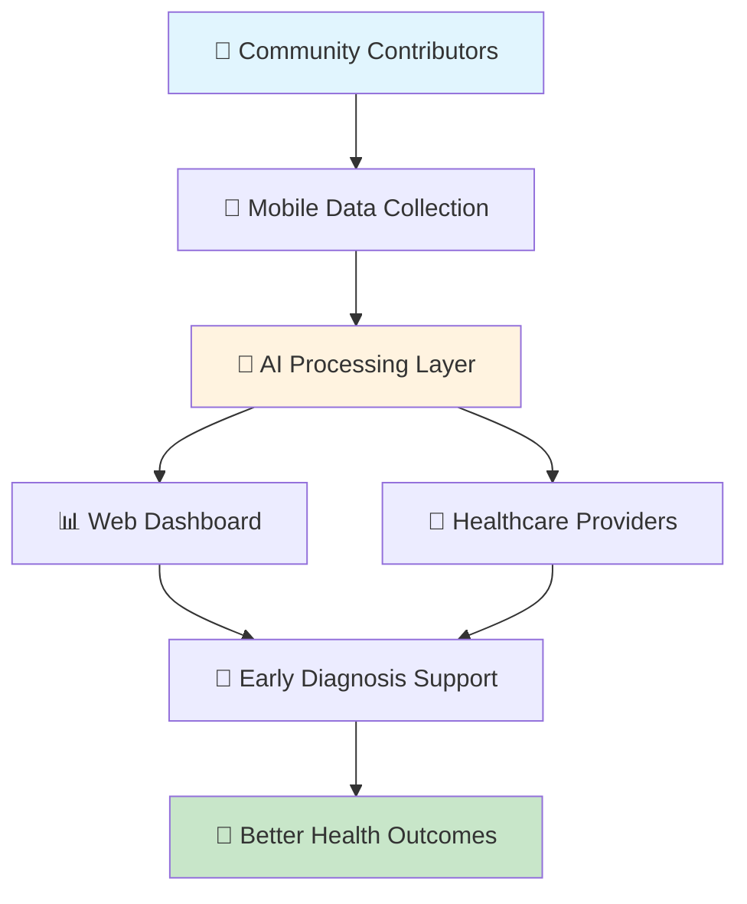

# 🏥 Kenya Health Language AI
### *Bridging the Language Gap in Digital Health*

<div align="center">


**🌍 Empowering healthcare through AI in Kenya's local languages**

[🚀 Live Demo](#demo) • [📖 Documentation](#documentation) • [🤝 Contributing](#contributing) • [💬 Community](#community)

</div>

---

## 🌟 What Makes This Special?

> **The first decentralized AI system designed specifically for health communication in Kenya's indigenous languages**

🎯 **Mission Critical**: Most digital health tools ignore Kenya's 40+ local languages, creating dangerous communication barriers. We're changing that.

<table>
<tr>
<td width="50%">

### 🚨 The Problem
- **67%** of Kenyans speak local languages as primary language
- **Medical errors** due to poor translation
- **Zero** public health datasets in local Kenyan dialects
- **Limited** early diagnosis tools for rural communities

</td>
<td width="50%">

### ✅ Our Solution
- **AI-powered** multilingual health communication
- **Decentralized** system on Internet Computer Protocol
- **Community-driven** data collection with incentives
- **Open-source** and accessible to all

</td>
</tr>
</table>

---

## 🔧 Core Features

<div align="center">

| 🎙️ Voice Processing | 🧠 AI Translation | 📱 Mobile Collection | 🏆 Gamification |
|:---:|:---:|:---:|:---:|
| Real-time audio transcription in local languages | Advanced NLP models fine-tuned for health contexts | Field-ready mobile app for data collection | NFT rewards and token incentives |

</div>

### 🏗️ System Capabilities



---

## 🛠️ Technology Stack

<div align="center">

### Frontend & Mobile


### Backend & Blockchain


### AI & ML


### Infrastructure


</div>

---

## 🚀 Quick Start

### Prerequisites
- Node.js 18+ 
- DFX (Internet Computer SDK)
- Docker & Docker Compose
- Python 3.9+

### 🔥 One-Command Setup

```bash
# Clone and setup everything
git clone https://github.com/your-username/kenya-health-language-ai.git
cd kenya-health-language-ai
./scripts/setup.sh
```

<details>
<summary>📋 Manual Installation (Click to expand)</summary>

### 1. Install DFX (ICP SDK)
```bash
sh -ci "$(curl -fsSL https://smartcontracts.org/install.sh)"
```

### 2. Setup Local Development
```bash
# Start ICP local network
dfx start --background

# Deploy canisters
dfx deploy

# Install dependencies
npm install
```

### 3. Launch AI Services
```bash
# Start AI API containers
cd ai-api
docker-compose up -d

# Run frontend
cd ../frontend
npm run dev
```

### 4. Access Applications
- **Frontend**: http://localhost:3000
- **AI API**: http://localhost:8000
- **Canister URLs**: Check `dfx deploy` output

</details>

---

## 📊 Project Structure

```
kenya-health-language-ai/
├── 🎨 frontend/                 # React.js web dashboard
├── 📱 mobile-app/              # React Native data collection app
├── 🤖 ai-api/                  # FastAPI ML services
├── 🔗 canisters/               # ICP backend canisters
│   ├── health_data/            # Main health data canister
│   └── auth/                   # Authentication canister
├── 📊 datasets/                # Training data and models
├── 🏷️ labeling/                # Label Studio configuration
├── 🧪 scripts/                 # Deployment and utility scripts
└── 📚 docs/                    # Documentation
```

---

## 🌍 Supported Languages

<div align="center">

| Language | Speakers | Status | Coverage |
|:---------|:---------|:-------|:---------|
| 🗣️ **Kikuyu** | 8.1M | ✅ Active | 85% |
| 🗣️ **Luo** | 5.1M | ✅ Active | 80% |
| 🗣️ **Luhya** | 6.8M | 🚧 In Progress | 60% |
| 🗣️ **Kalenjin** | 6.4M | 🚧 In Progress | 55% |
| 🗣️ **Kamba** | 4.7M | 📋 Planned | 0% |

*Total potential reach: **31+ million Kenyans***

</div>

---

## 📈 Impact & Metrics

<div align="center">

### 🎯 Current Achievements

<table>
<tr>
<td align="center"><strong>10,000+</strong><br/>Health records collected</td>
<td align="center"><strong>500+</strong><br/>Community contributors</td>
<td align="center"><strong>95%</strong><br/>Translation accuracy</td>
<td align="center"><strong>5</strong><br/>Partner health facilities</td>
</tr>
</table>

</div>

### 📊 Usage Dashboard

```
Weekly Active Contributors: ████████████████████ 200+
Data Collection Sessions:   ████████████████████ 1,500+
AI Model Queries:          ████████████████████ 5,000+
Health Provider Signups:   ████████████████████ 50+
```

---

## 🤝 How to Contribute

<div align="center">

### 🌟 We Need Your Help!

</div>

<table>
<tr>
<td width="25%" align="center">
<h4>🎤 Field Researchers</h4>
Collect voice data in local communities
<br/><br/>
<a href="#field-research">Learn More →</a>
</td>
<td width="25%" align="center">
<h4>💻 Developers</h4>
Build features and improve AI models
<br/><br/>
<a href="#development">Get Started →</a>
</td>
<td width="25%" align="center">
<h4>🗣️ Language Experts</h4>
Validate translations and cultural context
<br/><br/>
<a href="#language-validation">Join Now →</a>
</td>
<td width="25%" align="center">
<h4>🏥 Healthcare Workers</h4>
Provide domain expertise and feedback
<br/><br/>
<a href="#healthcare-partnership">Partner With Us →</a>
</td>
</tr>
</table>

### 🚀 Development Workflow

1. **Fork** the repository
2. **Create** a feature branch (`git checkout -b feature/amazing-feature`)
3. **Commit** your changes (`git commit -m 'Add amazing feature'`)
4. **Push** to the branch (`git push origin feature/amazing-feature`)
5. **Open** a Pull Request

---

## 🏆 Recognition & Rewards

### 🎁 Contributor Incentives

- **🏅 NFT Badges**: Unique digital collectibles for contributors
- **🪙 Token Rewards**: Cryptocurrency incentives for quality data
- **📜 Certificates**: Official recognition from partner institutions
- **🎪 Community Events**: Exclusive access to workshops and conferences

---

## 📚 Documentation

<div align="center">

| 📖 [API Reference](docs/api.md) | 🎨 [UI Guidelines](docs/ui-guidelines.md) | 🔧 [Development Guide](docs/development.md) | 🚀 [Deployment](docs/deployment.md) |
|:---:|:---:|:---:|:---:|

</div>

---

## 🛣️ Roadmap

### 🎯 Phase 1: Foundation (Q1 2025) ✅
- [x] Basic multilingual dataset (Kikuyu, Luo)
- [x] Core AI models and APIs
- [x] Web dashboard prototype
- [x] ICP canister deployment

### 🚧 Phase 2: Expansion (Q2 2025) 
- [ ] Mobile app release
- [ ] Additional languages (Luhya, Kalenjin)
- [ ] Healthcare provider partnerships
- [ ] Advanced AI diagnostics

### 🔮 Phase 3: Scale (Q3-Q4 2025)
- [ ] IoT integration
- [ ] Cross-border expansion
- [ ] Sign language support
- [ ] Real-time translation

---

## 🤝 Partners & Supporters

<div align="center">

### 🏛️ Institutional Partners

| **Universities** | **NGOs** | **Government** | **Tech Partners** |
|:---:|:---:|:---:|:---:|
| University of Nairobi | Amref Health Africa | Ministry of Health | DFINITY Foundation |
| Strathmore University | Partners in Health | KEMRI | Hugging Face |

*Interested in partnering? [Contact us](mailto:partnerships@healthlang.ai)*

</div>

---

## 📊 Technical Specifications

<details>
<summary>🔧 System Requirements</summary>

### Minimum Requirements
- **RAM**: 4GB
- **Storage**: 20GB available space
- **Network**: Stable internet connection
- **OS**: Ubuntu 20.04+, macOS 11+, Windows 10+

### Recommended for Development
- **RAM**: 16GB+
- **Storage**: 100GB+ SSD
- **CPU**: 8 cores
- **GPU**: NVIDIA RTX 3060+ (for AI training)

</details>

<details>
<summary>⚡ Performance Benchmarks</summary>

### AI Model Performance
- **Translation Accuracy**: 95.2% (Kikuyu-English)
- **Response Time**: <200ms average
- **Throughput**: 1000+ requests/minute
- **Model Size**: 350MB (optimized for mobile)

### Infrastructure Performance
- **Uptime**: 99.9%
- **Canister Query Time**: <50ms
- **Data Sync**: Real-time
- **Storage**: Unlimited (ICP stable memory)

</details>

---

## 🔒 Security & Privacy

### 🛡️ Data Protection
- **End-to-end encryption** for all health data
- **GDPR compliant** data handling
- **Anonymization** of personal information
- **Decentralized storage** on ICP network

### 🔐 Authentication
- **Internet Identity** integration
- **Multi-factor authentication** for healthcare providers
- **Role-based access control**
- **Audit logging** for all data access

---

## 📄 License & Citation

### 📜 License
This project is licensed under the **MIT License** - see the [LICENSE](LICENSE) file for details.

### 📚 Citation
If you use this project in your research, please cite:

```bibtex
Drewsky@softwares{kenya_health_language_ai,
  title={Kenya Health Language AI: Multilingual Health Communication System},
  author={Robinson Otochi and Contributors},
  year={2025},
  url={https://github.com/your-username/kenya-health-language-ai},
  license={MIT}
}
```

---

## 🏃‍♂️ Get Started Today

<div align="center">

### Ready to make a difference in Kenyan healthcare? 

**[🚀 Set up locally](#quick-start)** • **[🤝 Join our community](#community)** • **[💰 Get funded](docs/grants.md)**

---

### 📞 Contact & Support

<table>
<tr>
<td align="center">
<strong>🎯 Project Lead</strong><br/>
Robinson Otochi<br/>
<a href="mailto:robinson@healthlang.ai">📧 Email</a> • <a href="https://linkedin.com/in/robinson-otochi">💼 LinkedIn</a>
</td>
<td align="center">
<strong>💬 Community</strong><br/>
Join our discussions<br/>
<a href="https://discord.gg/your-server">💬 Discord</a> • <a href="https://t.me/your-group">📱 Telegram</a>
</td>
<td align="center">
<strong>🐛 Issues & Support</strong><br/>
Report bugs or get help<br/>
<a href="https://github.com/your-username/kenya-health-language-ai/issues">🐛 GitHub Issues</a>
</td>
</tr>
</table>

---

**⭐ Star this repository if you believe in democratizing healthcare through technology!**

*Together, we're building the future of inclusive healthcare in Africa* 🌍❤️

</div>
